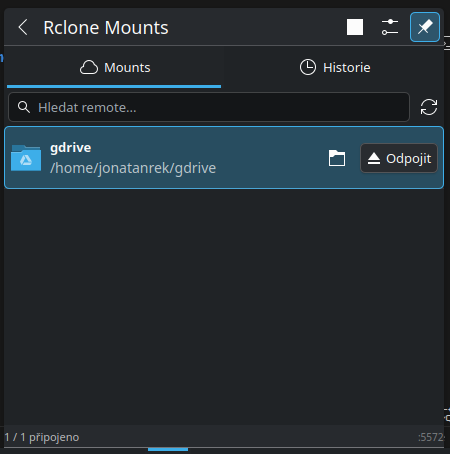
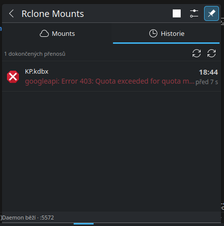

# Rclone Mounts — KDE Plasma Plasmoid

Widget pro **KDE Plasma 6** pro správu rclone cloudových úložišť přímo z panelu nebo plochy.




---

## Popis

Připojuj a odpojuj rclone remoty jedním kliknutím, sleduj historii přenosů a aktivní uploady/downloady — vše bez terminálu.

**Funkce:**
- Připojení / odpojení remotů jedním kliknutím
- Historie dokončených přenosů s indikátorem úspěchu / chyby
- Sledování aktivních přenosů v reálném čase
- Spuštění a zastavení rclone RC daemona z kontextového menu
- Vyhledávání remotů

---

## Instalace

```bash
git clone <repo-url>
cd rclone-mounts-plasmoid
chmod +x install.sh
./install.sh
```

Po instalaci: pravý klik na panel nebo plochu → **Přidat widget** → vyhledej **Rclone**.

> Vyžaduje: `rclone` a KDE Plasma 6

---

**Klíčová slova:** rclone, KDE Plasma, plasmoid, widget, cloud storage, mount, Google Drive, OneDrive, S3